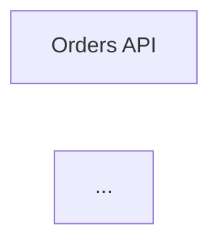

# Claim F20 — `decispec index`: GitHub-renderable decision index

- **Owner:** main-orchestrator (execution delegated to coder agent-1)
- **Status:** review
- **Started:** 2026-10-02 (no claim file existed at task start; created by the
  executor with the standard shape + evidence)

## Task

A new command `decispec index` writing a single GitHub-renderable markdown
file (`docs/decisions.md` by default) that embeds the project's mermaid
diagrams and decision/requirement/scenario tables, so a repo viewer sees the
whole decision picture on GitHub (native ```mermaid rendering).

## Scope

- crates: codegen (`render_index`), cli (`index [--out]` subcommand)
- root: README.md (command table), docs/USAGE.md (daily loop),
  ARCHITECTURE.md (command-list node), Cargo.lock (unchanged — no new deps)
- OUT of scope: `gen`'s artifact set and `is_managed_path` (point 3 of the
  brief — adding it there would make gen's sweep delete the index); all
  other crates (see fmt note below)

## Red evidence (2026-10-02)

TDD red-first in both crates:

- **codegen:** three new tests against a stub `render_index` (correct
  `GeneratedFile` path, empty content): `test result: FAILED. 0 passed;
  3 failed` — `index_renders_title_mermaid_fences_and_tables`,
  `index_renders_superseded_by_line`, `index_escapes_table_cells` all failed
  on the empty body (right reason). 20 pre-existing codegen tests green.
- **cli:** three new tests against the unwired command: compile errors
  `cannot find function cmd_index` (3×) — the right reason (missing
  command). After wiring the variant/dispatch with the real `cmd_index`,
  all three pass; `index_exits_2_when_specs_are_broken` additionally asserts
  no file is written on broken specs.

## Build evidence

`cargo build && cargo test --workspace`: **123 passed, 0 failed** (117
pre-F20 + 6 new: codegen 23 = 20+3, cli 22 = 19+3 — extract 26, gate 19,
ir 3, mcp 7, parse 13, store 3). `cargo clippy --workspace`: 0 warnings.

`cargo fmt`: run as instructed; it also reformatted pre-existing non-fmt
code in `crates/extract`, `crates/gate`, `crates/mcp` (all non-fmt already
at HEAD — verified via `git show HEAD:<file> | rustfmt --check`). Those
hunks were reverted to keep the F20 diff in scope; **my files
(codegen/src/lib.rs, cli/src/main.rs) are rustfmt-clean** (`rustfmt
--check` passes). A repo-wide `cargo fmt` commit of the three pre-existing
files is a separate one-command cleanup for the orchestrator.

Manual smoke (debug binary, `init --demo` in a temp dir): `decispec index`
→ `wrote docs/decisions.md`; head of output:

```
<!-- GENERATED BY DECISIONSPEC v0.1 — DO NOT EDIT. Edit specs/*.spec instead. -->
# Decision Index

_Generated by `decispec index` — do not edit._

## Model — specs/0001-auth.spec

| Container | Title |
| --- | --- |
| api | Orders API |
| auth | Auth Service |



## Change summary

- `crates/codegen/src/lib.rs` — public pure `render_index(&Workspace) ->
  GeneratedFile` (default path `docs/decisions.md`): H1 "Decision Index" +
  one-line generated note; per-model H2 section (heading = source spec file —
  models carry no id, the file IS their identity; containers table; one
  ```mermaid fence per model via a one-model `Workspace` shim around the
  existing whole-workspace `mermaid_model` — see judgment call below; then
  per-flow H3 sections with `mermaid_flow` fences); then per-decision H2
  sections (`ID — title`, bold status, superseded_by/context/consequences,
  Requirements table (id, text), Scenarios table (id, requirement id,
  layer(s), flattened given/when/then — one row per (requirement, scenario),
  unreferenced scenarios get requirement "—")). Private `md_cell` escapes
  `|` → `\|` and newlines → `<br>` in table cells only (mermaid/strings
  keep raw text); `scenario_text` flattens given/when/then. Header uses the
  shared `HEADER_TEXT` constant as an HTML comment so it stays invisible in
  GitHub's rendered view. NOT added to `render_all`/`is_managed_path` per
  the brief — `gen` never sweeps it. 3 new tests.
- `crates/cli/src/main.rs` — `Index { --out }` clap variant (doc comments in
  house style), dispatch via `find_project_root`, `cmd_index(root, out)`
  following the cmd_* template (load_workspace_or_bail → exit 2 on broken
  specs; default `docs/decisions.md`, `--out` overrides with forward-slash
  normalization; create parent dirs; print path). 3 new tests.
- `README.md` — `decispec index [--out <path>]` row in the Commands table
  (after extract). Note: the table still has no `mcp` row (F16 gap — left
  for the orchestrator).
- `docs/USAGE.md` — `decispec index` added to the §3 daily loop snippet.
- `ARCHITECTURE.md` — cli subgraph node now lists
  `cmd_extract · cmd_mcp · cmd_index`.
- `Cargo.lock` — unchanged (no dependency changes).

## Judgment calls

1. **Per-model vs single diagram** (the brief allowed either): `mermaid_model`
   renders the whole workspace, so `render_index` builds a one-model
   `Workspace` shim per model section (Model/Workspace are Clone) and calls
   it per model — each model section gets its own flowchart, matching the
   spec's primary option ("easy" per the brief's test).
2. **Model identity in the H2**: `Model` has no id field (containers, rels,
   flows, file), so the section heading is the source spec file
   (`## Model — specs/0001-auth.spec`).
3. **H1 title**: the spec'd signature `render_index(&Workspace)` cannot see
   the project name (that lives in `decispec.toml`, parsed by cli), so the
   H1 is the fallback "Decision Index". Passing `Config.project` would need
   a signature change — deferred to the reviewer.
4. **Scenario table text**: scenarios have no EARS text (that's
   requirements), so the table flattens given/when/then into one sentence.
5. **fmt scope**: see Build evidence — repo-wide `cargo fmt` would touch
   extract/gate/mcp (pre-existing non-fmt at HEAD); reverted, flagged for a
   separate cleanup commit.
