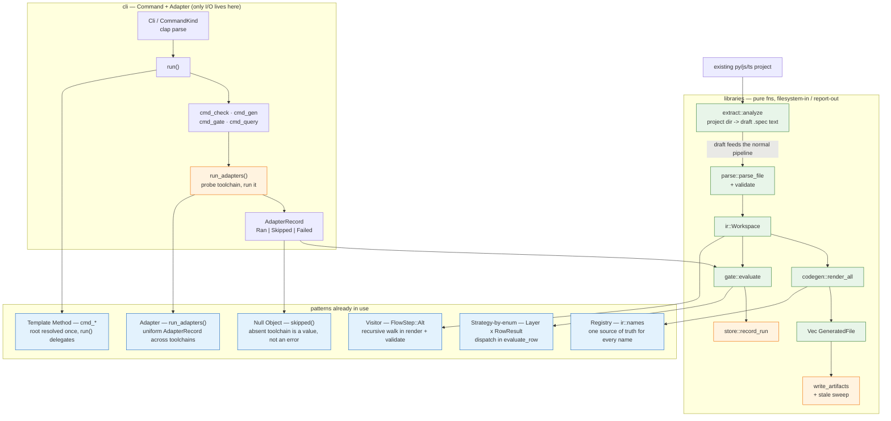

# Architecture and patterns

## The patterns, and where they actually are

**Visitor** — `ir::FlowStep` is an algebraic data type and the recursive walk is
hand-written wherever a flow is consumed: `render_mermaid_steps`,
`render_plantuml_steps`, and the participant validator in `parse::validate`.
F4 fixed a bug where the validator's walk was one level deep while the
renderers recursed; that class of bug is the standard Visitor maintenance
hazard, and the fix was to make the traversal uniform.

**Strategy-by-enum** — `gate::evaluate_row` dispatches on `Layer` and each arm
picks a matching strategy: unit uses `junit_matches` per item, contract/e2e use
precise-then-fallback (F6), infra/fitness use adapter status. The enum is the
strategy selector; there are no trait objects.

**Registry** — `ir::names` is the single source of truth for every generated
identifier. F6's whole safety argument rests on it: `contract_scenario_test_name`
is called by *both* codegen and gate, so the emitted name and the matched name
cannot drift. A duplicated format string across crates is the bug this prevents.

**Adapter** — `run_adapters()` normalizes pytest, cucumber, karate, playwright,
conftest and import-linter into one `AdapterRecord`, so `gate` never learns a
toolchain's name or invocation. Adding a toolchain touches one function.

**Template Method** — `run()` resolves the project root once and delegates to
`cmd_*`. F3 introduced the `root: &Path` parameter precisely so the base
concern (find root, map result to exit code) is fixed and the variable part
(each command's work) is swappable — and so commands are testable.

**Null Object** — a missing toolchain yields
`AdapterRecord { status: Skipped, reason }`, a value, rather than an error.
This is what makes F5's strict mode expressible as a policy on an existing
value instead of a special case threaded through error handling.

## Workflow

**F7 onward is TDD.** The loop is: write the test, run it, confirm it fails for the right reason, implement the minimum, re-run. For F7 the first run of `fitness_modules_use_configured_container_packages` failed with `no field named root_package` — red for the intended reason.

Not TDD for F1–F6. The actual loop was: specify behavior in a brief →
subagent implements and tests in one pass → orchestrator reviews and patches.
Tests were written alongside or after implementation, which is why both real
bugs this session (a temp-dir collision in `temp_project`, and the
`classname` probe that suppressed the F6 fallback) surfaced during review
rather than as a red test beforehand.

What was done consistently instead: **characterization before refactor** — read
the existing behavior and pin it in the brief so prior tests could not silently
change meaning.

## Two things TDD caught that review had not

Writing the test before the code changed the design twice, before any
user-visible behavior was locked in.

1. **The test could not be written.** The first draft asserted `depcruise` would
   also use the configured packages. It cannot: those are Python dotted module
   paths, while dependency-cruiser matches filesystem paths in a JS tree, so the
   mapping would emit a regex that never matches. Having to write that assertion
   is what made it visible.

2. **A plausible-but-wrong design got caught.** The first implementation used the
   resolved module path in the contract section names too, producing
   `[contract:rel_myapp.api_myapp.auth_forbidden]` — so a contract identity
   would change whenever `decispec.toml` was edited. A test asserting identity
   stability across config changes pinned it.

TDD is now a hard rule for all new work — see `AGENTS.md` §1. Coordination
between the multiple agents working this repo is via `.coord/` (board + claim
files), and every task passes an independent review before it is done
(`docs/REVIEW.md`).

## Remaining work for MVP (audit 2026-10-01)

Evidence-based; tracked on `.coord/BOARD.md`. Nothing in F1–F7's documented
scope is missing from code — the gaps are bugs, dead config, and coverage
holes rather than absent features.

1. **F9 — dependency-cruiser rule direction is inverted.** `codegen::depcruise`
   (codegen/src/lib.rs:412) emits, for `rel api -> auth`, a rule whose
   `from`/`to` forbid api→auth — the direction the import-linter contract
   explicitly *allows* ("api may import auth"), and the opposite of README:167
   ("forbids b → a"). dependency-cruiser's `from` is the dependent module, so
   the generated config fails allowed imports and permits forbidden ones. The
   existing test asserts rule *name* and regex *shape* only, which is why it
   slipped through. Fix TDD-style: failing direction-asserting test first.
2. **F10 — zero integration coverage of the binary.** All 67 tests are inline
   `#[cfg(test)]` unit tests; nothing executes the built `decispec`. The
   README quickstart (init → check → gen → test → gate → query) survives only
   because a manual `/tmp/decispec-demo` run once passed. Add an integration
   suite (std::process or `assert_cmd` dev-dep) that runs the real binary over
   a fixture project, including the exit-code contract.
3. **F11 — `[runners]` config is a dead letter.** Documented (README:227) and
   emitted as a comment by `init`, but `parse_config` never parses it and
   adapter invocations are hardcoded in `run_adapters`. Either implement the
   overrides or cut the section from the docs — documented-but-ignored config
   is the worst outcome.
4. **Accepted as MVP limitations (verified accurate against code):** contract/
   e2e reporter naming unverifiable in-repo (suite-level fallback exists),
   `.importlinter`/depcruise never executed against real toolchains, Rego TODO
   stubs, depcruise skipped without `src/` (so fitness on Python layouts never
   exercises it), no contradiction checking, no infra drift detection,
   single-line strings, Windows untested.
5. **Doc/code nits to fold into F9–F11 or the MVP-end docs pass:** README:163
   says "rstest-style" but codegen emits plain `#[test]` + `todo!()`;
   `init` never writes `[stack.fitness]` (fitness config is always manual);
   clap doc comment for `query` understates the IDs it resolves; the parse
   lexer accepts Unicode alphanumerics in IDs while the README documents the
   ASCII grammar (filed as F13 — extract's id scrubber already emits ASCII).

**F8 (`decispec extract`)** — LANDED 2026-10-01 (two review rounds, see
`.coord/reviews/F8.md`): bootstrap draft specs (model: containers from layout,
relationships from the import graph) plus `[stack.fitness.packages]`
suggestions from an already-started Python/JS/TS project. Design notes:
containers come from top-level directories, or — when a single umbrella dir
holds the code (`src/`, the main package) — from its children; DecisionSpec's own
scaffold (glue dir, `tests/generated`) is excluded from analysis; container
ids are scrubbed to the ASCII ID grammar before collision-suffixing; the
acceptance test round-trips the draft through the real parser + validator.
New `crates/extract` library, wired in `cli` (see diagram above). Extended by
**F15 (2026-10-01)**: ADR/markdown decision docs are ingested into `decision`
blocks (id from filename number or slug; title/status/context/consequences;
deprecated→superseded with a self-referenced `superseded_by` TODO placeholder
when no successor is determinable). Extraction stays deterministic —
requirements and `superseded_by` targets are never inferred; the agent/human
workflow for that layer is `docs/PORTING.md`.