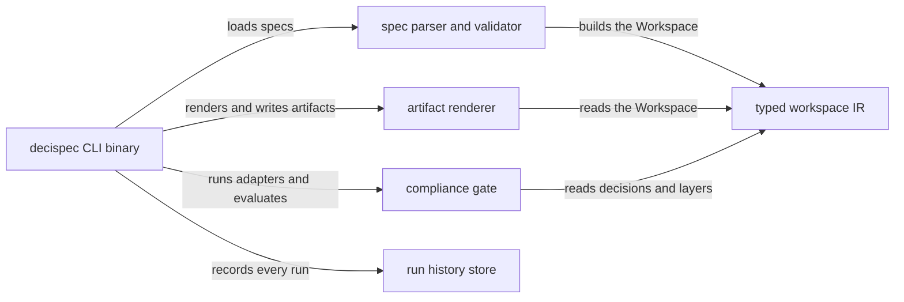
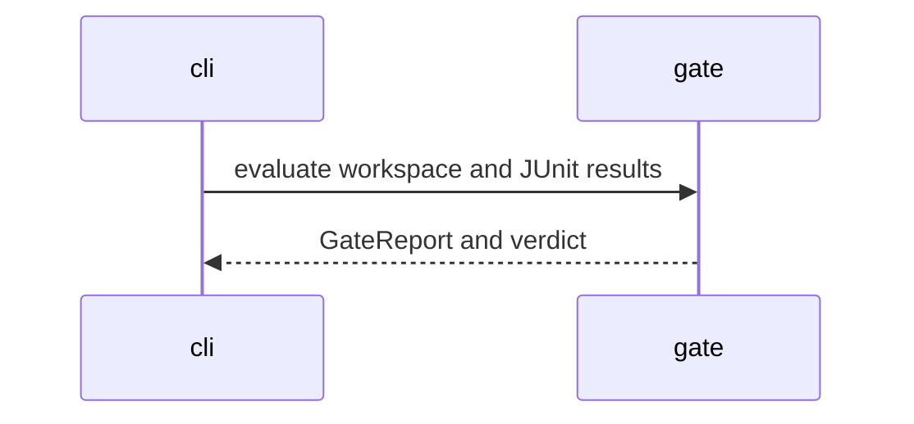

<!-- GENERATED BY DECISIONSPEC v0.1 — DO NOT EDIT. Edit specs/*.spec instead. -->
# Decision Index

_Generated by `decispec index` — do not edit._

## Model — specs/000-decisions.spec

| Container | Title |
| --- | --- |
| cli | decispec CLI binary |
| parse | spec parser and validator |
| ir | typed workspace IR |
| codegen | artifact renderer |
| gate | compliance gate |
| store | run history store |

### Flow: gate_run

## ARCH-001 — Library crates are pure: filesystem-in and report-out; every real write and process spawn lives in cli

**Status:** accepted

**Context:** AGENTS.md's crate table fixes the split in the 'Never contains' column (codegen: filesystem writes; gate: process spawning; extract: filesystem writes), and ARCHITECTURE.md's patterns presuppose it: pure libraries are what make the 131 inline unit tests possible while the F10 audit (2026-10-01) recorded zero integration coverage of the binary.

**Consequences:** + libraries are testable with no disk fixtures, and cli is the single file to audit for I/O. - a library that needs I/O must grow a parameter or move to cli. - the boundary is convention, not enforced by the type system, until F10's integration suite lands.

### Requirements

| ID | Requirement |
| --- | --- |
| ARCH-001-R1 | WHEN a library crate renders artifacts, evaluates reports, or extracts a draft THEN it SHALL return its result in memory without writing files or spawning processes |

### Scenarios

| ID | Requirement | Layer | Scenario |
| --- | --- | --- | --- |
| extract_stdout_writes_no_file | ARCH-001-R1 | unit | Given an existing Python/JS/TS project tree that analyze() accepted, when the draft spec is rendered with --stdout, then no spec file is created; the write path belongs to cli, not extract. |
| managed_paths_cover_only_gen_output_trees | ARCH-001-R1 | unit | Given a workspace whose specs render to artifacts, when codegen computes the set of managed output paths, then the set covers only the gen output trees, so the cli-side sweep writes nothing else. |
| failing_junit_yields_fail | ARCH-001-R1 | unit | Given a JUnit report supplied as an in-memory value with one failing testcase, when gate evaluates the report against the workspace, then the mapped row fails without gate touching the filesystem. |

## ARCH-002 — The exit vocabulary is exactly three codes: 0 clean, 1 completed-with-findings, 2 could-not-complete

**Status:** accepted

**Context:** README's exit-code section is normative: a CI step treats 1 as 'there is work to do' and 2 as 'the run itself is broken', and bad CLI usage exits 2 so a typo never reads as a compliance finding. Cli tests pin all three codes across gen, gate, index, and extract.

**Consequences:** + every command speaks the same three-way contract; CI sketches stay three lines. - new failure kinds must fold into 1 or 2, never a fourth code. - the contract is unit-tested only; F10 covers the binary end-to-end.

### Requirements

| ID | Requirement |
| --- | --- |
| ARCH-002-R1 | WHEN any decispec command finishes THEN it SHALL exit 0 when clean, 1 when it completed with findings, and 2 when it could not complete, and no other code |

### Scenarios

| ID | Requirement | Layer | Scenario |
| --- | --- | --- | --- |
| index_writes_decisions_md_and_exits_0 | ARCH-002-R1 | unit | Given a valid spec workspace, when decispec index runs, then docs/decisions.md is written and the exit code is 0. |
| gate_exits_1_on_fail_verdict | ARCH-002-R1 | unit | Given a workspace whose gate verdict is FAIL, when cmd_gate maps the verdict to an exit code, then the process exits 1. |
| gen_exits_2_when_specs_are_broken | ARCH-002-R1 | unit | Given specs that fail parse or validation, when decispec gen runs, then it exits 2 because codegen has no workspace to work with. |

## ARCH-003 — Every generated identifier is produced and matched through the ir::names registry

**Status:** accepted

**Context:** ARCHITECTURE.md's Registry pattern: F6's whole safety argument rests on contract_scenario_test_name being called by both codegen and gate, so the emitted name and the matched name cannot drift. The F9 rule-direction and F23 label-escaping fixes were tractable precisely because each format string lives in exactly one place.

**Consequences:** + one format string per identifier, so a rename propagates to both emitter and matcher at compile time. - the registry is a discipline rather than a type: a hand-rolled format string elsewhere still compiles, so review is the enforcement.

### Requirements

| ID | Requirement |
| --- | --- |
| ARCH-003-R1 | WHEN codegen names a generated test and the gate matches a JUnit result THEN both SHALL derive the name through ir::names |

### Scenarios

| ID | Requirement | Layer | Scenario |
| --- | --- | --- | --- |
| contract_scenario_test_name_joins_and_sanitizes | ARCH-003-R1 | unit | Given a contract-layer scenario id containing hyphens, when the scenario test name is generated, then the id is joined and sanitized to the pytest-safe form the gate will match. |
| e2e_test_name_matches_playwright_title | ARCH-003-R1 | unit | Given an e2e-layer scenario, when the Playwright spec title is generated, then it equals the title string the gate matches JUnit results against. |

## ARCH-004 — A missing toolchain is a Skipped value, and new toolchains are wired only in run_adapters()

**Status:** accepted

**Context:** ARCHITECTURE.md's Adapter and Null Object patterns: run_adapters normalizes pytest, cucumber, karate, playwright, conftest, and import-linter into one AdapterRecord, which is what let F5 express strict-skipped as a policy on an existing value instead of a special case in error handling, and let F11 land [runners] overrides through the same seam.

**Consequences:** + gate never learns a toolchain's name or invocation; adding a tool touches one function. - adapter behavior for a new tool is assumed, not verified: contract/e2e reporter naming is an explicit MVP limitation for exactly this reason.

### Requirements

| ID | Requirement |
| --- | --- |
| ARCH-004-R1 | WHEN a toolchain binary is absent THEN decispec test SHALL record the layer as skipped and complete normally, exiting 1 only when an executed toolchain fails |

### Scenarios

| ID | Requirement | Layer | Scenario |
| --- | --- | --- | --- |
| runner_override_missing_binary_skips_quietly_and_test_completes | ARCH-004-R1 | unit | Given a [runners] override whose binary does not exist on PATH, when decispec test probes and runs the adapters, then the layer is recorded as skipped and decispec test still completes and writes the manifest. |
| skipped_toolchain_is_not_a_failure | ARCH-004-R1 | unit | Given an adapter record with status Skipped for a row's layer, when the gate evaluates the row, then the row is skipped rather than failed. |

## PARSE-001 — Spec errors are reported as file:line diagnostics, one line per error

**Status:** accepted

**Context:** README:142 pins the shape — errors print as file:line: message — and both agents and CI parse these diagnostics (docs/USAGE.md troubleshooting). Parse tests pin the line reporting for duplicate ids, unterminated strings, and unknown layers.

**Consequences:** + errors are navigable in editors and greppable in logs. - diagnostics stop at the first error per phase (parse before cross-reference), so fixing one error can reveal the next.

### Requirements

| ID | Requirement |
| --- | --- |
| PARSE-001-R1 | WHEN a spec file contains an error THEN decispec check SHALL report it with the file path and line number |

### Scenarios

| ID | Requirement | Layer | Scenario |
| --- | --- | --- | --- |
| duplicate_id_reports_second_definition_line | PARSE-001-R1 | unit | Given two spec blocks that declare the same id, when cross-reference validation runs, then the diagnostic points at the second definition's file and line. |
| unterminated_string_reports_line | PARSE-001-R1 | unit | Given a spec file whose string literal is never closed, when the parser fails, then the diagnostic names the line where the string started. |

## GATE-001 — A gate row fails only for a named structural or evidentiary reason

**Status:** accepted

**Context:** README 'Gate semantics' enumerates exactly five failure shapes (a-e): decision without requirements, requirement without scenarios, layer with zero artifacts, an executed failing test, and an item whose toolchain ran but produced no result. The gate crate's tests pin four of them directly; the fifth (failing test) is pinned under ARCH-001.

**Consequences:** + the matrix is explainable row by row; a red gate always names its reason. - the enumeration is closed by convention: a new failure kind needs a new rule, a test, and a README row together.

### Requirements

| ID | Requirement |
| --- | --- |
| GATE-001-R1 | WHEN the gate builds the matrix THEN a row SHALL fail only when a decision lacks requirements, a requirement lacks scenarios, a layer has no generated artifacts, or the item's toolchain ran but produced no JUnit result |

### Scenarios

| ID | Requirement | Layer | Scenario |
| --- | --- | --- | --- |
| decision_with_no_requirements_fails | GATE-001-R1 | unit | Given an accepted decision with no requirements, when the gate evaluates the matrix, then the decision's row fails structurally. |
| requirement_with_no_scenarios_fails | GATE-001-R1 | unit | Given a requirement listing no scenarios, when the gate evaluates the matrix, then the requirement's row fails. |
| no_artifacts_is_structural_failure | GATE-001-R1 | unit | Given an item mapped to a layer whose generated directory is empty, when the gate evaluates the matrix, then the row reports NO-ARTIFACTS. |
| missing_result_for_executed_toolchain_is_uncovered | GATE-001-R1 | unit | Given an item whose toolchain ran but wrote no result for it, when the gate evaluates the matrix, then the row is UNCOVERED. |
| passing_junit_yields_pass | GATE-001-R1 | unit | Given a JUnit report whose cases all pass, when the gate evaluates the matrix, then the mapped rows pass. |

## GATE-002 — Strict mode escalates skipped rows to failures and nothing else

**Status:** accepted

**Context:** README: 'Pass --strict-skipped to close that hole in CI' — a missing toolchain is a silent pass by default, so CI needs the escalation. F5 built it as a policy on the existing Skipped value (ARCHITECTURE.md Null Object), and six tests pin the boundary: skipped becomes FAIL, passing projects stay passing, and structurally-failing rows are not double-counted.

**Consequences:** + CI gets one flag that turns toolchain absence red. - strict mode says nothing about rows that never had a toolchain (NO-ARTIFACTS stays its own failure); - local runs without the flag keep the silent-pass hole by design.

### Requirements

| ID | Requirement |
| --- | --- |
| GATE-002-R1 | WHEN --strict-skipped is passed THEN every row whose toolchain did not run SHALL fail while passing projects and no-artifacts rows keep their existing verdicts |

### Scenarios

| ID | Requirement | Layer | Scenario |
| --- | --- | --- | --- |
| strict_skipped_escalates_to_fail | GATE-002-R1 | unit | Given an adapter record with status Skipped, when the gate evaluates with --strict-skipped, then the row fails and report.json marks it strict-escalated. |
| gate_strict_skipped_turns_skipped_rows_into_findings | GATE-002-R1 | unit | Given a gate run with skipped rows, when cmd_gate maps a strict-mode FAIL verdict, then the process exits 1. |
| strict_skipped_escalates_when_manifest_absent | GATE-002-R1 | unit | Given a --results directory with no manifest at all, when the gate evaluates with --strict-skipped, then rows fail rather than passing on the empty directory. |
| strict_skipped_does_not_touch_no_artifacts | GATE-002-R1 | unit | Given a row already failing structurally for missing artifacts, when the gate evaluates with --strict-skipped, then the row is not counted twice. |
| strict_skipped_leaves_passing_project_passing | GATE-002-R1 | unit | Given a project whose executed tests all pass, when the gate evaluates with --strict-skipped, then the verdict stays PASS. |

## GATE-003 — Contract and e2e results map per item by generated name, degrading to suite level with a warning

**Status:** accepted

**Context:** README MVP limitations: precise per-item matching 'degrades to suite level' when a JUnit name does not carry the generated id, with a printed WARNING naming the item; F6's names registry (ARCH-003) is what makes the precise path possible, and the classname-only probe exists because cucumber reports the feature path there.

**Consequences:** + one broken scenario fails only its own row; a naming drift never silently reds unrelated rows. - suite-level fallback can mask a partially matching reporter, which is why the gate prints the WARNING instead of staying silent.

### Requirements

| ID | Requirement |
| --- | --- |
| GATE-003-R1 | WHEN a contract or e2e JUnit result matches a generated item id THEN only that item's row SHALL take the result and when no name matches the suite SHALL be judged as a whole with a warning |

### Scenarios

| ID | Requirement | Layer | Scenario |
| --- | --- | --- | --- |
| contract_row_fails_only_for_its_own_failing_scenario | GATE-003-R1 | unit | Given one failing contract scenario among several, when the gate maps results per item, then only that scenario's row fails. |
| contract_row_uncovered_when_no_result_for_that_scenario | GATE-003-R1 | unit | Given a contract scenario with no JUnit result, when the toolchain ran, then that row alone is UNCOVERED. |
| contract_falls_back_to_suite_level_when_ids_do_not_match | GATE-003-R1 | unit | Given results whose names carry no generated id, when per-item matching finds nothing, then the suite is judged whole and a warning names the item. |
| contract_falls_back_when_only_the_classname_carries_the_spec_id | GATE-003-R1 | unit | Given a cucumber report with the feature path in classname only, when per-item matching probes names and classname, then the classname match keeps the row precise. |
| e2e_row_fails_only_for_its_own_failing_scenario | GATE-003-R1 | unit | Given one failing e2e scenario among several, when the gate maps results per item, then only that scenario's row fails. |

## GATE-004 — A superseded decision warns instead of hard-failing the gate

**Status:** accepted

**Context:** README gate semantics: superseded decisions are excluded from hard failures, with coverage-drift detection if tests still map to them. That keeps history in the spec without letting retired decisions block the build.

**Consequences:** + old decisions stay documented and queryable at zero gate cost. - nothing forces removal of drifted coverage; the warning is easy to ignore for months.

### Requirements

| ID | Requirement |
| --- | --- |
| GATE-004-R1 | WHEN a decision's status is superseded THEN its rows SHALL produce warnings rather than hard failures |

### Scenarios

| ID | Requirement | Layer | Scenario |
| --- | --- | --- | --- |
| superseded_decision_is_warning_not_failure | GATE-004-R1 | unit | Given a superseded decision with requirements, when the gate evaluates the matrix, then it is listed as a warning, not a failure. |

## GATE-005 — JUnit input is parsed strictly: testsuite roots accepted, non-JUnit rejected

**Status:** accepted

**Context:** The gate consumes whatever adapters emit (roxmltree), and the two parsing tests pin both ends of the contract: a testsuite-rooted document is accepted, and XML that is not JUnit is rejected rather than misread.

**Consequences:** + malformed adapter output surfaces as a parse error instead of a nonsense matrix. - the parser accepts any testsuite-shaped XML; a tool emitting nonstandard but valid JUnit may still need adapter massaging first.

### Requirements

| ID | Requirement |
| --- | --- |
| GATE-005-R1 | WHEN the gate reads a result file THEN it SHALL accept JUnit with a testsuite root and reject XML that is not JUnit |

### Scenarios

| ID | Requirement | Layer | Scenario |
| --- | --- | --- | --- |
| junit_parsing_handles_testsuite_root | GATE-005-R1 | unit | Given a result file rooted at testsuite instead of testsuites, when the gate parses it, then its cases are read. |
| junit_parsing_rejects_non_junit | GATE-005-R1 | unit | Given an XML document with no JUnit shape, when the gate parses it, then parsing fails instead of yielding an empty matrix. |

## GATE-006 — A gate that cannot load its workspace exits 2 without a verdict

**Status:** accepted

**Context:** README's deliberate asymmetry: check reports malformed specs as findings (exit 1) because diagnosing specs is its job, while gen and gate abort on the same specs and exit 2 — they have nothing to work with. The cli pins the gate half of that contract.

**Consequences:** + CI never mistakes a spec typo for a compliance violation. - the exit-2 path produces no matrix, so a broken run and a violated gate are distinguishable only by exit code, which is exactly the intent.

### Requirements

| ID | Requirement |
| --- | --- |
| GATE-006-R1 | WHEN specs fail parse or validation THEN gate SHALL exit 2 without rendering a verdict |

### Scenarios

| ID | Requirement | Layer | Scenario |
| --- | --- | --- | --- |
| gate_exits_2_when_specs_are_broken | GATE-006-R1 | unit | Given specs that fail validation, when cmd_gate runs, then it exits 2 because no matrix can be built. |

## GEN-001 — Every generated artifact carries the do-not-edit header and regeneration is byte-identical

**Status:** accepted

**Context:** README: 'Everything generated carries a GENERATED BY DECISIONSPEC header; regeneration is byte-identical.' The header is also the stale-sweep's deletion key (GEN-002), so its exact first-two-line shape is pinned by test.

**Consequences:** + agents and humans can tell generated from hand-written at a glance, and re-running gen is a no-op diff. - the header text is now a format contract: changing it invalidates every previously generated file's sweep key.

### Requirements

| ID | Requirement |
| --- | --- |
| GEN-001-R1 | WHEN gen renders an artifact THEN the file SHALL start with the DecisionSpec do-not-edit header and re-rendering the same workspace SHALL be byte-identical |

### Scenarios

| ID | Requirement | Layer | Scenario |
| --- | --- | --- | --- |
| generated_header_detection_matches_first_two_lines | GEN-001-R1 | unit | Given any generated file, when the sweep checks whether it may delete the file, then the header is matched on its first two lines exactly. |
| regeneration_is_byte_identical | GEN-001-R1 | unit | Given a rendered workspace, when render_all runs again on the same IR, then every artifact's bytes are unchanged. |

## GEN-002 — The sweep deletes only stale DecisionSpec artifacts and never creates managed directories

**Status:** accepted

**Context:** README: gen 'removes stale artifacts whose spec item disappeared' and 'never touches tests/glue/'. F28 dogfood relies on this: edited spec ids must sweep their old files without endangering foreign files. The cli pins the end-to-end sweep and the absent-directory case.

**Consequences:** + deleting a spec item cleans up after itself, including in the dogfooded repo's own tests/generated. - a file that loses its header (hand edit) becomes foreign and is never swept, by design.

### Requirements

| ID | Requirement |
| --- | --- |
| GEN-002-R1 | WHEN gen sweeps THEN it SHALL delete only files bearing the DecisionSpec header whose item no longer exists, leave foreign files untouched, and never create managed directories |

### Scenarios

| ID | Requirement | Layer | Scenario |
| --- | --- | --- | --- |
| gen_removes_stale_artifacts_and_keeps_foreign_files | GEN-002-R1 | unit | Given an output tree with a stale generated file and a foreign file, when gen runs after its spec item disappeared, then the stale file is deleted and the foreign file remains. |
| sweep_does_not_create_managed_dirs_when_absent | GEN-002-R1 | unit | Given a project where no artifacts were ever generated, when the sweep runs, then no managed directory is created just to sweep it. |

## GEN-003 — Generated test artifacts embed the spec and item ids the gate matches on

**Status:** accepted

**Context:** README 'Codegen mapping': pytest files, contract features, Playwright titles, and rust skeletons all carry the spec item id, sanitized through ir::names (ARCH-003), so gate matching is a name comparison. F6/F23 fixed the escaping half of this contract.

**Consequences:** + the gate needs no out-of-band mapping from artifact to spec item. - the ids become public API: renaming a scenario changes generated test names and can break historical JUnit comparisons.

### Requirements

| ID | Requirement |
| --- | --- |
| GEN-003-R1 | WHEN artifacts are generated for spec items THEN their file names, test names, and titles SHALL embed the spec and item ids as produced by ir::names |

### Scenarios

| ID | Requirement | Layer | Scenario |
| --- | --- | --- | --- |
| pytest_files_embed_spec_and_item_ids | GEN-003-R1 | unit | Given a scenario on the unit layer, when its pytest file is generated, then the spec id and scenario id appear in the test function name. |
| contract_feature_is_idempotent | GEN-003-R1 | unit | Given a contract-layer scenario, when its feature file is generated twice, then the bytes are identical and the scenario name embeds the ids. |
| playwright_spec_shape_is_pinned | GEN-003-R1 | unit | Given an e2e-layer scenario, when its Playwright spec is generated, then the title embeds the spec and scenario ids in the pinned shape. |
| rust_skeletons_emitted_only_for_rust_stack | GEN-003-R1 | unit | Given a workspace whose decispec.toml sets lang = rust, when unit artifacts are generated, then rstest-style skeletons appear under tests/generated/unit/rust and reference the glue path. |
| contract_e2e_infra_fitness_artifacts | GEN-003-R1 | unit | Given scenarios on contract and e2e plus an infra policy, when artifacts are generated, then each layer's artifact set matches the documented mapping. |
| contract_and_e2e_names_survive_norm | GEN-003-R1 | unit | Given ids needing normalization, when contract and e2e names are produced and normalized, then the round trip preserves the matchable name. |

## GEN-004 — Mermaid edge labels are plain ASCII; PlantUML keeps raw labels

**Status:** accepted

**Context:** F19/F23 (user-reported, verified against mermaid.ink): GitHub's markdown pipeline decodes HTML entities before Mermaid parses, so only plain characters survive; the charset rule is now [A-Za-z0-9 ,./:-] with parens and pipes collapsed. PlantUML never needed the workaround.

**Consequences:** + diagrams render on GitHub without a 400 from Mermaid. - labels lose characters silently (parens become nothing, other punctuation becomes '-'), which can obscure a label's meaning.

### Requirements

| ID | Requirement |
| --- | --- |
| GEN-004-R1 | WHEN a diagram edge label is rendered THEN Mermaid SHALL receive plain ASCII from the pinned charset and PlantUML SHALL keep the raw label |

### Scenarios

| ID | Requirement | Layer | Scenario |
| --- | --- | --- | --- |
| mermaid_edge_labels_are_plain_ascii_only | GEN-004-R1 | unit | Given a rel label with characters outside the allowed set, when the mermaid model is rendered, then the label is plain ASCII from the pinned charset. |
| mermaid_edge_labels_drop_parens | GEN-004-R1 | unit | Given a rel label containing parentheses, when the mermaid model is rendered, then the parens are dropped, not entity-escaped. |
| mermaid_edge_labels_replace_pipe | GEN-004-R1 | unit | Given a rel label containing a pipe, when the mermaid model is rendered, then the pipe is replaced so the edge syntax stays parseable. |
| plantuml_edge_labels_keep_raw_parens | GEN-004-R1 | unit | Given a rel label containing parentheses, when the PlantUML diagram is rendered, then the label is emitted raw. |

## GEN-005 — Model and flow diagrams render every declared container, rel, and nested alt/else branch

**Status:** accepted

**Context:** The Visitor pattern hazard called out in ARCHITECTURE.md — F4 fixed a validator walk that was one level deep while renderers recursed — is exactly why the nested-alt rendering tests exist for both Mermaid and PlantUML.

**Consequences:** + a flow that nests alt/else renders the same structure in both diagram languages. - rendering is verified at string level only; visual layout is the diagram tool's business.

### Requirements

| ID | Requirement |
| --- | --- |
| GEN-005-R1 | WHEN the model or a flow is rendered THEN every declared container and rel SHALL appear and nested alt/else blocks SHALL be preserved in both Mermaid and PlantUML |

### Scenarios

| ID | Requirement | Layer | Scenario |
| --- | --- | --- | --- |
| model_diagrams_include_containers_and_rels | GEN-005-R1 | unit | Given a model with containers and rels, when the model diagram is rendered, then every container and rel edge appears. |
| mermaid_flow_with_alt_else | GEN-005-R1 | unit | Given a flow with alt/else branches, when the mermaid sequence diagram is rendered, then alt and else frames appear with sync and return arrows mapped. |
| mermaid_flow_with_nested_alt | GEN-005-R1 | unit | Given a flow whose alt branch contains another alt, when the mermaid sequence diagram is rendered, then the nesting is preserved. |
| plantuml_flow_with_alt_else | GEN-005-R1 | unit | Given a flow with alt/else branches, when the PlantUML diagram is rendered, then alt/else groups appear. |
| plantuml_flow_with_nested_alt | GEN-005-R1 | unit | Given a flow whose alt branch contains another alt, when the PlantUML diagram is rendered, then the nesting is preserved. |

## GEN-006 — The decision index renders a GitHub-ready page or exits 2 on broken specs

**Status:** accepted

**Context:** F20 landed index as an on-demand render (docs/decisions.md) with mermaid fences, escaped table cells, and the superseded_by line; it reuses the gen family's load-or-bail rule so a broken workspace exits 2 instead of publishing a stale page.

**Consequences:** + anyone browsing the repo sees the whole decision picture without running the tool. - the index is generated on demand only, so it rots unless a human or CI runs decispec index after spec edits.

### Requirements

| ID | Requirement |
| --- | --- |
| GEN-006-R1 | WHEN index runs on a valid workspace THEN it SHALL render mermaid fences and decision tables into docs/decisions.md or the --out path with markdown escaping and exit 2 when specs do not parse |

### Scenarios

| ID | Requirement | Layer | Scenario |
| --- | --- | --- | --- |
| index_renders_title_mermaid_fences_and_tables | GEN-006-R1 | unit | Given a valid workspace, when render_index runs, then the page carries the title, mermaid fences, and decision tables. |
| index_escapes_table_cells | GEN-006-R1 | unit | Given decision text containing pipes or newlines, when the index tables are rendered, then cells are markdown-escaped. |
| index_renders_superseded_by_line | GEN-006-R1 | unit | Given a superseded decision with a successor, when the index tables are rendered, then the superseded_by line names the successor. |
| index_honors_out_override | GEN-006-R1 | unit | Given an --out argument, when decispec index runs, then the page is written to the override path. |
| index_exits_2_when_specs_are_broken | GEN-006-R1 | unit | Given specs that fail validation, when decispec index runs, then it exits 2. |

## GEN-007 — Fitness configs are emitted only for fully-mapped rels and never abort the toolchain

**Status:** accepted

**Context:** F27 (verified against import-linter 2.5.2): a contract naming an unmapped container aborts the whole file, and sections must be spelled importlinter:contract:<id> or zero contracts evaluate. F9 (verified against dependency-cruiser 18.5.0): rules must forbid the to-side importing the from-side with segment-anchored paths or allowed imports fail and siblings false-positive.

**Consequences:** + the fitness row means something when green: contracts evaluated and paths anchored. - rels with an unmapped endpoint are only TODO comments, so their direction is unenforced until someone maps the container.

### Requirements

| ID | Requirement |
| --- | --- |
| GEN-007-R1 | WHEN fitness artifacts are generated THEN an import-linter contract SHALL exist only when both containers are mapped, unmapped endpoints SHALL become TODOs, and dependency-cruiser rules SHALL forbid the to-side importing the from-side with segment-anchored paths |

### Scenarios

| ID | Requirement | Layer | Scenario |
| --- | --- | --- | --- |
| importlinter_emits_contracts_only_for_python_mapped_rels | GEN-007-R1 | unit | Given rels with zero, one, or two mapped endpoints, when the .importlinter file is generated, then contracts exist only for fully mapped rels under importlinter: sections. |
| unmapped_containers_get_todos_instead_of_bogus_contracts | GEN-007-R1 | unit | Given a rel with an unmapped endpoint, when the .importlinter file is generated, then a TODO names the container to map and no contract references it. |
| fitness_modules_use_configured_container_packages | GEN-007-R1 | unit | Given a [stack.fitness.packages] mapping, when contracts are generated, then modules use the configured dotted paths. |
| fitness_contract_identity_survives_config_changes | GEN-007-R1 | unit | Given a rel with mapped endpoints, when decispec.toml's package mapping is edited, then the contract section identity stays stable. |
| depcruise_forbids_the_to_side_from_importing_the_from_side | GEN-007-R1 | unit | Given a rel a -> b, when the dependency-cruiser config is generated, then the forbidden direction is b importing a, asserted by side. |
| depcruise_paths_are_segment_anchored_without_rejected_regex_constructs | GEN-007-R1 | unit | Given container ids as paths, when the dependency-cruiser config is generated, then paths are segment-anchored and free of constructs depcruise rejects as unsafe. |
| depcruise_keeps_container_ids_as_filesystem_paths | GEN-007-R1 | unit | Given a JS/TS tree where a container is a directory, when the dependency-cruiser config is generated, then container ids stay filesystem path segments. |
| depcruise_config_documents_that_paths_match_container_directories | GEN-007-R1 | unit | Given the generated dependency-cruiser config, when a reader checks the path convention, then the config documents that paths match container directories. |

## DSL-002 — Every cross-reference in a spec must resolve to a declared item

**Status:** accepted

**Context:** README: 'IDs must be unique across the workspace' and check 'enforces ID uniqueness and cross-references with file:line errors'. PARSE-001 pins the diagnostic shape; this decision pins the referential closure a valid workspace must have.

**Consequences:** + a workspace that checks clean cannot dangle: no spec without its decision, no requirement without its scenario, no flow participant that is not a container. - uniqueness is global, so two teams landing the same id collide even when their domains never meet (F24 wants per-owner scoping for exactly this).

### Requirements

| ID | Requirement |
| --- | --- |
| DSL-002-R1 | WHEN a workspace is validated THEN every spec-to-decision reference, requirement-to-scenario reference, layer name, flow participant, and superseded_by target SHALL resolve to a declared item or check SHALL report it with file and line |

### Scenarios

| ID | Requirement | Layer | Scenario |
| --- | --- | --- | --- |
| unknown_decision_ref_for_spec | DSL-002-R1 | unit | Given a spec block naming a decision that does not exist, when validation runs, then the error points at the spec block. |
| unknown_scenario_ref_reports_requirement_line | DSL-002-R1 | unit | Given a requirement listing a scenario that does not exist, when validation runs, then the error points at the requirement line. |
| unknown_layer_reports_file_and_line | DSL-002-R1 | unit | Given a requirement naming a layer outside the pinned set, when validation runs, then the error names the file and line. |
| unknown_superseded_by_target | DSL-002-R1 | unit | Given a superseded decision whose superseded_by names nothing, when validation runs, then the error points at the dangling target. |
| undeclared_flow_participant | DSL-002-R1 | unit | Given a flow message whose endpoint is not a declared container, when validation runs, then the participant error names the flow. |
| bad_status_reports_expected_values | DSL-002-R1 | unit | Given a decision whose status is not in the pinned enum, when validation runs, then the error lists the expected values. |

## DSL-003 — Flow alt/else blocks nest to arbitrary depth and must be closed

**Status:** accepted

**Context:** README flow semantics: 'either branch may itself contain alt blocks, to arbitrary depth', and an unclosed block is a parse error. F4 (ARCHITECTURE.md) is the cautionary tale: the validator once walked one level deep while renderers recursed; the traversal is now uniform, and these tests keep it that way.

**Consequences:** + flows can express nested decision trees without a depth limit. - the recursion is hand-written in every consumer of FlowStep, so a future consumer can reintroduce the F4 class of bug without these tests.

### Requirements

| ID | Requirement |
| --- | --- |
| DSL-003-R1 | WHEN a flow contains alt blocks THEN they SHALL nest to arbitrary depth and parse and an unclosed block SHALL be a parse error |

### Scenarios

| ID | Requirement | Layer | Scenario |
| --- | --- | --- | --- |
| parses_nested_alt | DSL-003-R1 | unit | Given a flow with an alt inside an alt, when the spec is parsed, then the nested structure survives the parse. |
| nested_alt_uses_nested_container | DSL-003-R1 | unit | Given a nested alt flow, when the flow is validated, then the nested container is walked, not just the top level. |
| rejects_unclosed_nested_alt | DSL-003-R1 | unit | Given a flow whose inner alt is never closed, when the spec is parsed, then parsing fails with a parse error. |
| parses_demo_spec | DSL-003-R1 | unit | Given the README quickstart demo spec, when it is parsed, then it produces the documented IR. |
| demo_spec_validates_clean | DSL-003-R1 | unit | Given the README quickstart demo spec, when it is validated, then no diagnostics are produced. |

## CMD-001 — Containers come from top-level directories, promoting an umbrella src dir's children

**Status:** accepted

**Context:** README extract: 'containers from top-level directories — or from the children of a single umbrella directory that holds the code', relationships from the import graph. This layout rule was tuned on real ports (tvgo's umbrella src/ promotion) and its inverse: two real top-level dirs are never promoted.

**Consequences:** + a standard layout produces a usable model with zero configuration. - unconventional layouts (code at repo root in one flat dir, multiple umbrellas) get a coarse or surprising container split.

### Requirements

| ID | Requirement |
| --- | --- |
| CMD-001-R1 | WHEN extract analyzes a project THEN containers SHALL come from top-level directories or from the children of a single umbrella directory holding the code and relationships SHALL come from the import graph |

### Scenarios

| ID | Requirement | Layer | Scenario |
| --- | --- | --- | --- |
| analyze_python_project_containers_and_rels | CMD-001-R1 | unit | Given a python project with top-level packages importing each other, when analyze runs, then containers and import-graph relationships are recovered. |
| analyze_python_umbrella_project_promotes_children | CMD-001-R1 | unit | Given a python project whose code lives under one umbrella directory, when analyze runs, then the umbrella's children become the containers. |
| analyze_ts_project_maps_relative_imports_between_top_level_dirs | CMD-001-R1 | unit | Given a JS/TS project with relative imports between top-level directories, when analyze runs, then the imports map to relationships between those containers. |
| analyze_ts_umbrella_project_promotes_src_children | CMD-001-R1 | unit | Given a JS/TS project whose code lives under src/, when analyze runs, then src's children become the containers. |
| two_top_level_dirs_with_children_are_not_promoted | CMD-001-R1 | unit | Given two top-level directories that both hold code, when analyze decides the layout, then the directories themselves stay the containers. |
| single_dir_with_only_loose_files_stays_one_container | CMD-001-R1 | unit | Given a single directory containing only loose files, when analyze runs, then it stays one container. |
| loose_root_py_files_land_in_a_project_named_container | CMD-001-R1 | unit | Given loose python files at the project root, when analyze runs, then they land in a container named after the project. |
| python_import_forms | CMD-001-R1 | unit | Given python files using assorted import forms, when the import graph is built, then each form resolves to a relationship. |
| python_relative_imports_resolve_to_own_container | CMD-001-R1 | unit | Given python files using relative imports, when the import graph is built, then they resolve to the importing file's own container, not a fake edge. |
| js_import_forms | CMD-001-R1 | unit | Given JS/TS files using assorted import forms, when the import graph is built, then each form resolves to a relationship. |

## CMD-002 — Decisions are recovered from ADR markdown; requirements are never inferred

**Status:** accepted

**Context:** F15: ADR docs under docs/adr/, docs/decisions/, adr/, decisions/ become decision blocks (id from filename number or slug, title/status/context/consequences, deprecated becomes superseded with a TODO successor). Recovery stops at structure by design — the acceptance test round-trips the draft through the real parser and validator.

**Consequences:** + a project that wrote ADRs gets its decision history for free. - requirements stay the human/agent's job, so a recovered draft is never gateable as-is; - ADR conventions outside the parsed shapes (custom headings, tables) are skipped or flattened.

### Requirements

| ID | Requirement |
| --- | --- |
| CMD-002-R1 | WHEN ADR markdown docs exist under the documented directories THEN they SHALL become decision blocks carrying id, title, status, context, and consequences, and the rendered draft SHALL pass the real parser and validator without inferred requirements |

### Scenarios

| ID | Requirement | Layer | Scenario |
| --- | --- | --- | --- |
| adr_madr_fixture_maps_fields | CMD-002-R1 | unit | Given a MADR-format ADR file, when decisions are ingested, then title, status, context, and consequences map onto the decision block. |
| adr_status_from_heading_and_inline_line | CMD-002-R1 | unit | Given an ADR with its status in a heading or an inline line, when decisions are ingested, then the status is recovered either way. |
| adr_case_insensitive_dirs_and_render_order | CMD-002-R1 | unit | Given ADR directories with case variations and files in mixed order, when decisions are ingested and rendered, then all documented directories are read and the render order is deterministic. |
| adr_slug_ids_scrubbed_and_collision_suffixed | CMD-002-R1 | unit | Given ADR filenames whose slugs fall outside the ID charset or collide, when decision ids are derived, then ids are scrubbed and collision-suffixed. |
| adr_long_context_flattened_and_id_collision_with_container | CMD-002-R1 | unit | Given an ADR with multi-line context, or a decision id colliding with a container id, when decisions are ingested, then the context flattens to one line and the collision is resolved. |
| adr_missing_title_skipped_and_missing_status_warns | CMD-002-R1 | unit | Given an ADR with no title, or one with no status, when decisions are ingested, then the titleless ADR is skipped and the statusless one warns. |
| adr_excluded_dir_contributes_nothing | CMD-002-R1 | unit | Given an ADR inside an excluded directory, when decisions are ingested, then it contributes nothing. |
| rendered_draft_parses_and_validates_with_the_real_parser | CMD-002-R1 | unit | Given an analyzed project with ADRs, when the draft is rendered and fed to the real parser and validator, then it validates clean. |
| render_spec_shows_header_containers_and_rels | CMD-002-R1 | unit | Given an analysis result, when the draft is rendered, then the header, containers, and relationships all appear. |
| extract_writes_draft_with_decisions_from_adrs | CMD-002-R1 | unit | Given a project whose docs/adr directory holds ADR files, when cmd_extract writes the draft, then the written file contains the recovered decision blocks. |

## CMD-003 — Extract refuses unsafe or empty inputs with exit 2 rather than writing a partial draft

**Status:** accepted

**Context:** README: extract 'refuses to overwrite' an existing draft (exit 2), exits 2 'when the tree has no source files or cannot be analyzed', and DecisionSpec's own scaffold (glue dir, tests/generated) is excluded from analysis so a re-run over a ported project does not ingest its own output.

**Consequences:** + a draft is never half-written or silently clobbered; the failure is loud and in the standard exit vocabulary. - the refusal gives no merge path: the human must delete or --stdout the old draft by hand.

### Requirements

| ID | Requirement |
| --- | --- |
| CMD-003-R1 | WHEN the tree has no source files, the path is not a directory, the draft already exists, or the target is DecisionSpec's own scaffold THEN extract SHALL exit 2 or exclude the scaffold instead of writing a partial draft |

### Scenarios

| ID | Requirement | Layer | Scenario |
| --- | --- | --- | --- |
| empty_tree_reports_no_source_files | CMD-003-R1 | unit | Given a directory with no source files, when analyze runs, then it reports no source files. |
| non_directory_reports_not_a_directory | CMD-003-R1 | unit | Given an extract path that is a file, not a directory, when analyze runs, then it reports not a directory. |
| extract_writes_draft_and_refuses_to_overwrite | CMD-003-R1 | unit | Given an analyzable project, when cmd_extract runs twice, then the first run writes the draft and the second refuses with exit 2. |
| extract_with_no_source_files_is_cannot_complete | CMD-003-R1 | unit | Given a tree with no source files, when cmd_extract runs, then the exit code is 2. |
| extract_with_missing_path_arg_is_cannot_complete | CMD-003-R1 | unit | Given an extract invocation without its path argument, when cmd_extract runs, then the exit code is 2. |
| extract_without_project_root_is_cannot_complete | CMD-003-R1 | unit | Given a directory that is not inside a DecisionSpec project, when cmd_extract runs, then the exit code is 2. |
| extract_ignores_decispec_scaffold_when_detecting_language | CMD-003-R1 | unit | Given a project that already contains DecisionSpec's own scaffold, when extract detects the language, then the scaffold does not skew the result. |
| extract_ignores_glue_scaffold_in_python_projects | CMD-003-R1 | unit | Given a python project containing the glue scaffold, when analyze walks the tree, then the glue scaffold is excluded. |

## CMD-004 — Container ids are scrubbed to the ASCII ID grammar and collisions are suffixed, never fatal

**Status:** accepted

**Context:** F8: container ids are scrubbed to the ASCII ID grammar before collision-suffixing, keeping generated drafts inside the documented ID charset (F13 wants the lexer tightened to match). Directory noise (node_modules, .git, ...) is never descended into, and layout oddities warn instead of aborting.

**Consequences:** + a directory named anything produces a legal draft. - scrubbing can map two distinct names to one id, so the numeric suffixes are load-bearing; - a tree with more than 30 containers warns about grouping and still emits.

### Requirements

| ID | Requirement |
| --- | --- |
| CMD-004-R1 | WHEN container titles or ADR ids fall outside the ID charset or collide THEN extract SHALL scrub them, dedupe with numeric suffixes, and warn rather than fail |

### Scenarios

| ID | Requirement | Layer | Scenario |
| --- | --- | --- | --- |
| container_ids_scrub_chars_outside_the_id_charset | CMD-004-R1 | unit | Given directory names with characters outside [A-Za-z0-9_-], when container ids are derived, then the offending characters are scrubbed. |
| container_ids_sanitize_and_dedupe_with_numeric_suffixes | CMD-004-R1 | unit | Given names that sanitize to the same base, when container ids are derived, then dedupe appends numeric suffixes. |
| scrubbed_id_collisions_still_get_distinct_suffixes | CMD-004-R1 | unit | Given scrubbed ids that collide after a prior dedupe, when container ids are derived, then they still receive distinct suffixes. |
| more_than_30_containers_warn_about_grouping | CMD-004-R1 | unit | Given a tree with more than 30 containers, when analyze runs, then a grouping warning is emitted, not an error. |
| noise_dirs_are_never_descended_into | CMD-004-R1 | unit | Given directories like node_modules and .git, when analyze walks the tree, then they are never descended into. |
| title_escaping_handles_quotes_and_backslashes | CMD-004-R1 | unit | Given a container title containing quotes or backslashes, when the draft is rendered, then the title is escaped and the draft still parses. |
| language_tie_breaks_to_python | CMD-004-R1 | unit | Given a tree whose contents are ambiguous between languages, when the language is detected, then the tie breaks to python. |
| js_family_without_ts_files_is_javascript | CMD-004-R1 | unit | Given a JS-family tree with no TypeScript files, when the language is detected, then it is classified as javascript. |
| analyze_with_exclusions_skips_scaffold_dirs | CMD-004-R1 | unit | Given configured exclusion directories, when analyze walks the tree, then the excluded directories are skipped. |

## CMD-005 — decispec.toml drives stack, fitness, and runner configuration with documented defaults

**Status:** accepted

**Context:** README 'decispec.toml': lang, glue_module, fitness root_package and packages map container ids to importable modules (GEN-007), and [runners] overrides per-tool commands (F11). The config parser tests pin defaults for missing keys and inline-comment stripping.

**Consequences:** + one small file steers every toolchain invocation, with defaults that keep a minimal config working. - config is a second source of truth next to the spec files; nothing yet lints a stale or contradictory config (F11's landing note records the exact keys).

### Requirements

| ID | Requirement |
| --- | --- |
| CMD-005-R1 | WHEN the config file is parsed THEN missing keys SHALL keep their defaults, inline comments SHALL be stripped, fitness package mappings SHALL be read, and runner overrides SHALL reach both probe and run |

### Scenarios

| ID | Requirement | Layer | Scenario |
| --- | --- | --- | --- |
| config_parser_keeps_defaults_for_missing_keys | CMD-005-R1 | unit | Given a config file with most keys absent, when parse_config runs, then the documented defaults apply. |
| config_parser_strips_inline_comments | CMD-005-R1 | unit | Given config values carrying inline comments, when parse_config runs, then the comments are stripped, not parsed as value. |
| config_reads_fitness_package_map | CMD-005-R1 | unit | Given a [stack.fitness.packages] table, when parse_config runs, then the container-to-module map is read. |
| config_fitness_defaults_are_empty_and_unmapped | CMD-005-R1 | unit | Given no fitness configuration, when parse_config runs, then fitness defaults to empty and unmapped. |
| config_reads_runners_table | CMD-005-R1 | unit | Given a [runners] table, when parse_config runs, then the per-tool overrides are read. |
| adapter_uses_runner_override_for_probe_and_run | CMD-005-R1 | unit | Given a configured runner override, when adapters probe and run, then the override command is used for both. |

## STORE-001 — Every gate run is recorded in sqlite and re-readable

**Status:** accepted

**Context:** README data flow: gate reports flow to store, and `decispec query` reads the last gate status from .decispec/decispec.db. The store tests pin the schema-once behavior and the timestamp shape query displays.

**Consequences:** + gate history survives across runs for query and future drift analysis. - the db is a local artifact, not committed, so history is per-checkout.

### Requirements

| ID | Requirement |
| --- | --- |
| STORE-001-R1 | WHEN a gate run finishes THEN it SHALL be persisted to .decispec/decispec.db, readable back, with the schema created once and timestamps formatted as UTC RFC3339 |

### Scenarios

| ID | Requirement | Layer | Scenario |
| --- | --- | --- | --- |
| record_and_read_back | STORE-001-R1 | unit | Given a finished gate report, when the run is recorded and queried, then the report reads back intact. |
| opening_twice_reuses_schema | STORE-001-R1 | unit | Given an existing decispec.db, when the store opens again, then the existing schema is reused, not recreated. |
| now_utc_formats_rfc3339ish | STORE-001-R1 | unit | Given a recorded run, when its timestamp is formatted, then the shape is UTC RFC3339. |

## CMD-006 — Extract proposes a [stack.fitness] mapping for the analyzed layout

**Status:** accepted

**Context:** F8 ships a suggested [stack.fitness.packages] mapping alongside the draft (python: sanitized dotted modules under a suggested root package; JS/TS: directory paths, with a warning that the python-only glue does not apply). F17's dogfood finding (tvgo) records why the mapping matters: without it, library imports drown in 'did not map' warnings.

**Consequences:** + a ported project starts with fitness contracts that can actually evaluate. - the suggestion is derived from directory names, so a renamed or nonstandard package layout needs manual correction before the contracts are trustworthy.

### Requirements

| ID | Requirement |
| --- | --- |
| CMD-006-R1 | WHEN extract renders the analysis THEN it SHALL suggest a [stack.fitness] mapping using dotted module paths for python and directory paths for JS/TS, sanitizing every proposed module name |

### Scenarios

| ID | Requirement | Layer | Scenario |
| --- | --- | --- | --- |
| fitness_toml_suggests_python_root_package_and_dotted_modules | CMD-006-R1 | unit | Given an analyzed python project, when the fitness TOML is suggested, then it names a root package and dotted modules for the containers. |
| fitness_toml_sanitizes_python_package_names | CMD-006-R1 | unit | Given container names that are not importable module names, when the fitness TOML is suggested, then the proposed modules are sanitized. |
| fitness_toml_for_js_uses_dir_paths_and_warns_about_glue | CMD-006-R1 | unit | Given an analyzed JS/TS project, when the fitness TOML is suggested, then it uses directory paths and warns that the glue module does not apply. |

## MCP-001 — The MCP server speaks NDJSON JSON-RPC over stdio with six typed tools

**Status:** accepted

**Context:** F16 (README 'Using with AI agents'): `decispec mcp` serves newline-delimited JSON-RPC 2.0 so agents call typed tools instead of parsing CLI output — built from a real agent port where the friction was schemas-in-tools/list and JSON-inside-the-envelope results (F18 friction log).

**Consequences:** + agents get structured answers with input schemas discoverable in-band. - the wire format is hand-rolled NDJSON; it is tested over buffers, not against the MCP reference client.

### Requirements

| ID | Requirement |
| --- | --- |
| MCP-001-R1 | WHEN an agent connects over stdio THEN the server SHALL dispatch tools/list and tools/call envelopes, advertise exactly six tools with input schemas, and answer initialize without unsolicited notifications |

### Scenarios

| ID | Requirement | Layer | Scenario |
| --- | --- | --- | --- |
| tools_list_has_six_tools_with_schemas | MCP-001-R1 | unit | Given a running server, when tools/list is requested, then exactly six tools are advertised, each with its input schema. |
| serve_io_dispatches_ndjson_over_buffers | MCP-001-R1 | unit | Given NDJSON requests on stdin, when serve_io dispatches them, then each request gets a well-formed JSON-RPC reply on stdout. |
| initialize_result_and_notifications_silent | MCP-001-R1 | unit | Given an initialize handshake, when the server replies, then the result is well-formed and no notifications are emitted. |
| mcp_subcommand_parses_and_dispatches | MCP-001-R1 | unit | Given the decispec mcp invocation, when the cli parses the subcommand, then it dispatches to the server entry point. |

## MCP-002 — The MCP tools answer the porting workflow without parsing CLI output

**Status:** accepted

**Context:** README tool table: project_info, extract_project, validate_spec (iterate-before-you-write, diagnostics phase-by-phase), check_workspace, workspace_overview (the porting work queue), gate_status. F18's real-agent friction log shaped these: schemas live in tools/list, results are JSON inside the content envelope.

**Consequences:** + an agent can bootstrap, validate, and monitor a port entirely through typed calls. - tool payloads are a second surface to keep aligned with CLI behavior; nothing generates one from the other.

### Requirements

| ID | Requirement |
| --- | --- |
| MCP-002-R1 | WHEN an agent calls the workspace tools THEN it SHALL receive the project overview, spec diagnostics, gate status, and an extract bootstrap as structured JSON |

### Scenarios

| ID | Requirement | Layer | Scenario |
| --- | --- | --- | --- |
| validate_spec_reports_diagnostics_and_error_codes | MCP-002-R1 | unit | Given spec text with errors, when validate_spec is called, then file:line-style diagnostics and error codes come back as structured JSON. |
| workspace_overview_lists_porting_gaps | MCP-002-R1 | unit | Given a workspace with coverage gaps, when workspace_overview is called, then the porting queue lists decisions missing requirements and requirements missing scenarios. |
| gate_status_reports_missing_and_parses_report | MCP-002-R1 | unit | Given a project with and then without a gate report, when gate_status is called, then it reports 'no report yet' first and parses the verdict after a run. |
| extract_project_returns_decisions_and_containers | MCP-002-R1 | unit | Given an analyzable project, when extract_project is called, then the draft's decisions and containers come back as structured JSON. |

